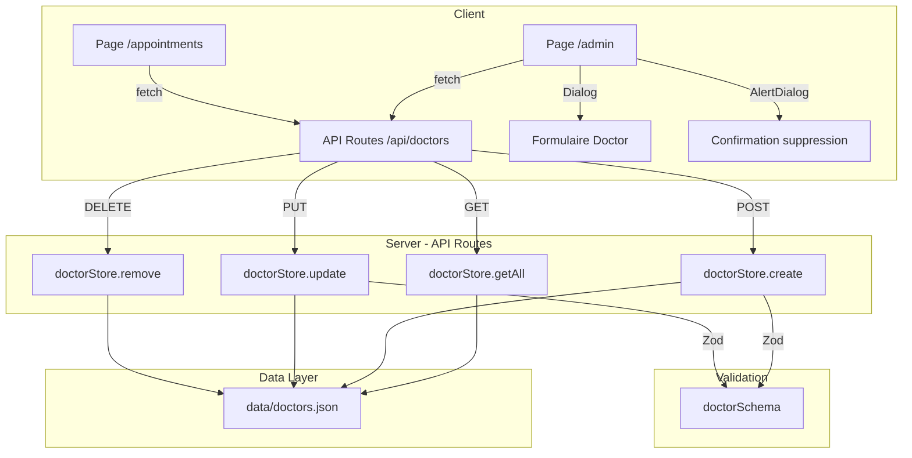

# Document de conception — Gestion des médecins (Admin)

## Vue d'ensemble

Cette fonctionnalité remplace le stockage Supabase des médecins par un fichier JSON local (`data/doctors.json`) et ajoute une interface d'administration CRUD complète à la route `/admin`. Le système repose sur des API Routes Next.js 15 (App Router) pour les opérations CRUD, une validation Zod côté serveur, et une page admin utilisant les composants shadcn/ui existants (Dialog, AlertDialog, Table, etc.). Le système de rendez-vous existant est mis à jour pour consommer l'API locale au lieu de Supabase.

### Décisions de conception clés

1. **Fichier JSON local plutôt que base de données** : Simplicité de déploiement, pas de dépendance externe. Suffisant pour un annuaire de taille modeste.
2. **Validation Zod** : Déjà présent dans le projet, utilisé pour valider les données côté API avant écriture.
3. **Composants shadcn/ui existants** : Dialog pour les modales add/edit, AlertDialog pour la confirmation de suppression, Table pour la liste, Toast pour les notifications.
4. **Pas d'authentification admin** : Hors périmètre de cette itération. Le lien `/admin` est accessible à tous.

## Architecture



### Flux de données

1. **Lecture** : Le client (admin ou appointments) appelle `GET /api/doctors` → le route handler lit `data/doctors.json` → retourne le tableau JSON.
2. **Création** : Le formulaire admin envoie `POST /api/doctors` avec le body → validation Zod → génération d'un `id` unique → écriture dans le fichier → retour du médecin créé.
3. **Modification** : Le formulaire admin envoie `PUT /api/doctors/[id]` → validation Zod partielle → merge avec les données existantes → écriture → retour du médecin mis à jour.
4. **Suppression** : L'admin confirme → `DELETE /api/doctors/[id]` → filtrage du tableau → écriture → retour 200.

## Composants et interfaces

### Nouveaux fichiers

| Fichier | Rôle |
|---|---|
| `src/lib/doctor-store.ts` | Module serveur : lecture/écriture du fichier JSON, CRUD |
| `src/lib/doctor-validation.ts` | Schémas Zod pour la validation des données médecin |
| `src/app/api/doctors/route.ts` | Route handler GET (liste) et POST (création) |
| `src/app/api/doctors/[id]/route.ts` | Route handler PUT (modification) et DELETE (suppression) |
| `src/app/admin/page.tsx` | Page admin — liste des médecins + actions CRUD |
| `src/components/doctor-form-modal.tsx` | Modale avec formulaire pour ajout/modification |
| `src/components/doctor-delete-dialog.tsx` | AlertDialog de confirmation de suppression |

### Fichiers modifiés

| Fichier | Modification |
|---|---|
| `src/services/doctors.ts` | `getDoctors()` appelle `GET /api/doctors` au lieu de Supabase, fallback inchangé |
| `src/components/navbar.tsx` | Ajout du lien "Admin" avec icône `Settings` |
| `src/locales/fr/translation.json` | Ajout des clés de traduction admin |

### Interfaces des composants

```typescript
// doctor-form-modal.tsx
interface DoctorFormModalProps {
  open: boolean;
  onOpenChange: (open: boolean) => void;
  doctor?: Doctor;          // undefined = mode création, défini = mode édition
  onSuccess: (doctor: Doctor) => void;
}

// doctor-delete-dialog.tsx
interface DoctorDeleteDialogProps {
  open: boolean;
  onOpenChange: (open: boolean) => void;
  doctor: Doctor;
  onConfirm: () => void;
}
```

### API doctor-store

```typescript
// src/lib/doctor-store.ts
export function getAllDoctors(): Promise<Doctor[]>;
export function getDoctorById(id: string): Promise<Doctor | undefined>;
export function createDoctor(data: Omit<Doctor, 'id'>): Promise<Doctor>;
export function updateDoctor(id: string, data: Partial<Omit<Doctor, 'id'>>): Promise<Doctor>;
export function deleteDoctor(id: string): Promise<boolean>;
```

## Modèles de données

### Type Doctor existant (inchangé)

```typescript
// src/types/doctor.ts — déjà existant, pas de modification
export interface Doctor {
  id: string;
  name: string;
  specialty: string;
  location?: string;
  bio?: string;
  available: string[];
  rating?: number;
  reviews?: number;
}
```

### Schéma de validation Zod

```typescript
// src/lib/doctor-validation.ts
import { z } from 'zod';

const VALID_DAYS = ['Lun', 'Mar', 'Mer', 'Jeu', 'Ven', 'Sam', 'Dim'] as const;

export const doctorCreateSchema = z.object({
  name: z.string().min(2, 'Le nom doit contenir au moins 2 caractères'),
  specialty: z.string().min(1, 'La spécialité est requise'),
  location: z.string().optional(),
  bio: z.string().optional(),
  available: z.array(z.enum(VALID_DAYS)).min(1, 'Au moins un jour de disponibilité est requis'),
  rating: z.number().min(0).max(5).optional(),
  reviews: z.number().int().min(0).optional(),
});

export const doctorUpdateSchema = doctorCreateSchema.partial();

export type DoctorCreateInput = z.infer<typeof doctorCreateSchema>;
export type DoctorUpdateInput = z.infer<typeof doctorUpdateSchema>;
```

### Structure du fichier JSON

```json
// data/doctors.json
[
  {
    "id": "dr-1",
    "name": "Dr. Aminata Diallo",
    "specialty": "Généraliste",
    "location": "Dakar",
    "bio": "Médecin généraliste avec 12 ans d'expérience.",
    "available": ["Lun", "Mar", "Mer", "Jeu", "Ven"],
    "rating": 4.8,
    "reviews": 124
  }
]
```


## Propriétés de correction

*Une propriété est une caractéristique ou un comportement qui doit rester vrai pour toutes les exécutions valides d'un système — essentiellement, une déclaration formelle de ce que le système doit faire. Les propriétés servent de pont entre les spécifications lisibles par l'humain et les garanties de correction vérifiables par la machine.*

### Propriété 1 : Round-trip de sérialisation Doctor

*Pour tout* objet Doctor valide (conforme au schéma Zod `doctorCreateSchema`), la création via `createDoctor()` suivie d'une lecture via `getDoctorById()` SHALL retourner un objet dont tous les champs (name, specialty, location, bio, available, rating, reviews) sont identiques à l'entrée originale (à l'exception de l'id qui est généré).

**Valide : Exigences 1.3, 3.6**

### Propriété 2 : Acceptation des données Doctor valides

*Pour tout* objet conforme au schéma `doctorCreateSchema` (name ≥ 2 caractères, specialty non vide, available contenant uniquement des jours valides parmi ["Lun","Mar","Mer","Jeu","Ven","Sam","Dim"], rating optionnel entre 0 et 5, reviews optionnel entier ≥ 0), la validation Zod SHALL réussir sans erreur.

**Valide : Exigences 3.1, 3.2, 3.3, 3.4, 3.5**

### Propriété 3 : Rejet des données Doctor invalides

*Pour tout* objet ayant au moins un champ invalide (name vide ou < 2 caractères, specialty vide, available contenant des valeurs hors liste, rating hors [0,5], reviews négatif ou non-entier), la validation Zod SHALL échouer avec un message d'erreur descriptif.

**Valide : Exigences 2.5, 3.1, 3.2, 3.3, 3.4, 3.5**

### Propriété 4 : Unicité des identifiants générés

*Pour tout* ensemble de N médecins créés via `createDoctor()`, tous les identifiants générés SHALL être distincts les uns des autres.

**Valide : Exigence 1.4**

## Gestion des erreurs

| Scénario | Comportement attendu |
|---|---|
| Fichier `data/doctors.json` inexistant | Création automatique avec les 6 médecins de fallback |
| Fichier JSON invalide (parse error) | Retour des données de fallback, log console.error |
| Erreur d'écriture fichier (permissions, disque plein) | API retourne HTTP 500 avec message d'erreur JSON |
| POST/PUT avec données invalides | API retourne HTTP 400 avec détails des erreurs Zod (champ + message) |
| PUT/DELETE avec id inexistant | API retourne HTTP 404 avec message "Médecin introuvable" |
| Appel API `/api/doctors` échoue côté client | Le service `getDoctors()` retourne les données de fallback |
| Appel API retourne une liste vide | La page appointments affiche "Aucun médecin disponible" |

### Format des erreurs API

```json
{
  "error": "Données invalides",
  "details": [
    { "field": "name", "message": "Le nom doit contenir au moins 2 caractères" },
    { "field": "available", "message": "Au moins un jour de disponibilité est requis" }
  ]
}
```

## Stratégie de tests

### Approche duale

Cette fonctionnalité combine de la logique pure (validation, sérialisation) et de l'intégration (API routes, UI). La stratégie de test reflète cette dualité :

#### Tests property-based (vitest + fast-check)

La bibliothèque **fast-check** sera utilisée avec vitest pour les tests de propriétés. Chaque test de propriété exécutera un minimum de **100 itérations**.

- **Propriété 1** : Générer des objets Doctor aléatoires valides, les créer dans le store, les relire, vérifier l'égalité des champs.
  - Tag : `Feature: admin-doctor-management, Property 1: Doctor serialization round-trip`
- **Propriété 2** : Générer des objets conformes au schéma, vérifier que `doctorCreateSchema.safeParse()` réussit.
  - Tag : `Feature: admin-doctor-management, Property 2: Valid doctor data acceptance`
- **Propriété 3** : Générer des objets avec au moins un champ invalide, vérifier que `doctorCreateSchema.safeParse()` échoue.
  - Tag : `Feature: admin-doctor-management, Property 3: Invalid doctor data rejection`
- **Propriété 4** : Créer N médecins, vérifier que tous les IDs sont uniques.
  - Tag : `Feature: admin-doctor-management, Property 4: Unique ID generation`

#### Tests unitaires (vitest)

- Validation Zod : cas limites spécifiques (nom de 1 caractère, nom de 2 caractères, rating exactement 0 et 5, tableau available vide)
- Doctor store : fichier inexistant → création avec fallback, fichier JSON invalide → fallback
- Formatage des erreurs API

#### Tests d'intégration (vitest)

- API routes : GET retourne la liste, POST crée un médecin, PUT met à jour, DELETE supprime
- API routes : 400 pour données invalides, 404 pour id inexistant, 500 pour erreur d'écriture
- Service `getDoctors()` : appelle `/api/doctors`, fallback en cas d'erreur

#### Tests de composants (vitest + testing-library)

- Page admin : affichage de la liste, skeleton pendant le chargement, message d'erreur
- Formulaire modale : ouverture, pré-remplissage en mode édition, validation côté client
- Dialog de suppression : ouverture, confirmation, annulation
- Navbar : présence du lien Admin, état actif sur `/admin`
